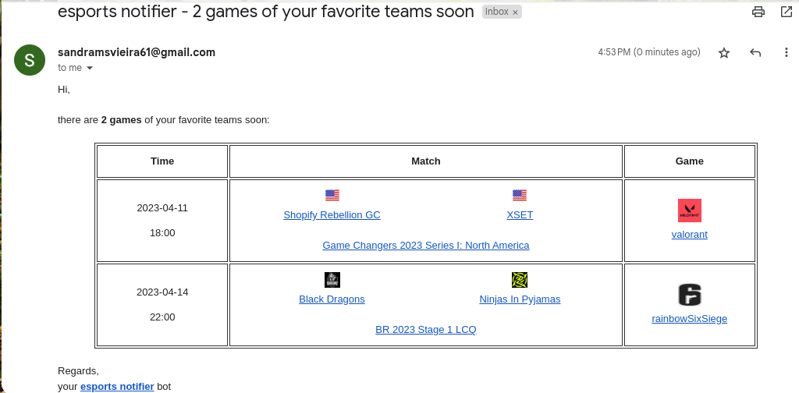
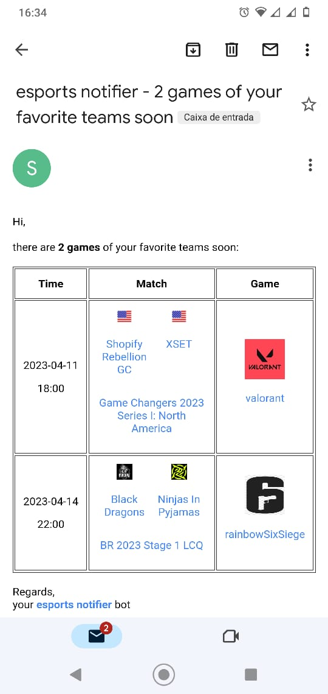
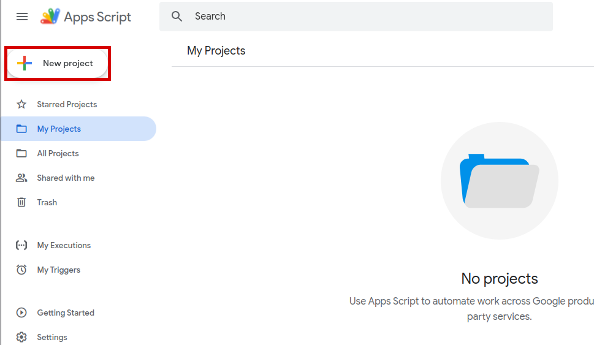

<a name="TOC"></a>

<h3 align="center">
  ESPORTS NOTIFIER
</h3>

<div align="center">
  <a href="https://nodejs.org/en/"></a>
  <a href="https://www.google.com/script/start/"></a>
  <a href="https://github.com/lucasvtiradentes/esports-notifier#contributing"></a>
  <br>
  <a href="https://www.npmjs.com/package/esports-notifier"></a>
  <a href="https://github.com/lucasvtiradentes/esports-notifier/actions/workflows/ci-cd.yml"></a>
</div>

<p align="center">
  <a href="#dart-features">Features</a> • <a href="#warning-requirements">Requirements</a> • <a href="#bulb-usage">Usage</a> • <a href="#wrench-development">Development</a>  • <a href="#books-about">About</a>
</p>

<details>
  <summary align="center"><span>see <b>table of content</b></span></summary>
  <p align="center">
    <ul>
      <!-- <li><a href="#trumpet-overview">Overview</a></li> -->
      <!-- <li><a href="#pushpin-table-of-contents">TOC</a></li> -->
      <li><a href="#dart-features">Features</a></li>
      <li><a href="#warning-requirements">Requirements</a></li>
      <li>
        <a href="#bulb-usage">Usage</a>
        <ul>
          <li><a href="#how-it-works">How it works?</a></li>
          <li><a href="#installation">Installation</a></li>
          <li><a href="#updating">Updating</a></li>
          <li><a href="#uninstall">Uninstall</a></li>
        </ul>
      </li>
      <li>
        <a href="#wrench-development">Development</a>
        <ul>
          <li><a href="#development-setup">Development setup</a></li>
          <li><a href="#used-technologies">Used technologies</a></li>
        </ul>
      </li>
      <li>
        <a href="#books-about">About</a>
        <ul>
          <li><a href="#related">Related</a></li>
          <li><a href="#license">License</a></li>
          <li><a href="#feedback">Feedback</a></li>
        </ul>
      </li>
    </ul>
  </p>
</details>

<a href="#"></a>

## :trumpet: Overview

Receive a **daily email** informing **whenever at least one of your favorite esports teams has a match** on the current date in a bunch of esports games, including _csgo_, _valorant_ and _rainbow six siege_.

<div align="center">
  <table align="center">
    <thead>
      <tr>
        <td><p align="center">Desktop view</p></td>
        <td><p align="center">Mobile view</p></td>
      </tr>
    </thead>
    <tbody>
      <tr>
        <td></td>
        <td></td>
      </tr>
    </tbody>
 </table>
</div>

<a name="GAMES"></a>

It is worth mentioning that the tool currently informs about the following games with each respective source:

- [x] counter-strike global offense: [liquipedia](https://liquipedia.net/counterstrike/Liquipedia:Matches)
- [x] valorant: [vlr.gg](https://www.vlr.gg/matches)
- [x] rainbow six siege: [siege.gg](https://siege.gg/matches)
<!--
- [ ] overwatch 2
- [ ] dota 2
- [ ] league of legends
- [ ] free fire
- [ ] rocket league
- [ ] call of duty
      -->

## :dart: Features<a href="#TOC"></a>

&nbsp;&nbsp;&nbsp;✔️ receive a daily email informing whenever at least one of your favorite teams has a match in the current date;<br>
&nbsp;&nbsp;&nbsp;✔️ select the games you are interested in to check for matches;<br>
&nbsp;&nbsp;&nbsp;✔️ specify the time to send the daily email;<br>
&nbsp;&nbsp;&nbsp;✔️ option to inform matches about only the current date or also from the following days.<br>

## :warning: Requirements<a href="#TOC"></a>

The only thing you need to use this project is a `gmail/google account`.

## :bulb: Usage<a href="#TOC"></a>

### How it works

It basically sets a function to run in [google apps scripts](https://www.google.com/script/start/) to run everyday at a specified time, and this function is responsable for:

- get all the the matches scheduled for the next couple of days in all games that you're interested in;
- filter the matches list to get only the ones about your favorite teams;
- if there's at least one game of your favorite teams, send you an email about informing the details.

The matches list are obtained from a bunch of specialize sites. You can check the corresponding site of everygame by clicking in their links in <a href="#GAMES">this section</a>.

### Installation

To effectively use this project, do the following steps:

<details>
  <summary>1 - create a Google Apps Scripts (GAS) project</summary>
  <div>
    <br>
    <p>Go to the <a href="https://www.google.com/script/start/">google apps script</a> and create a new project by clicking in the button showed in the next image.<br>
    It would be a good idea to rename the project to something like "esports-notifier".</p>
    <p align="center"></p>
  </div>
</details>

<details>
  <summary>2 - setup the esports-notifier code on GAS</summary>
  <div>
    <br>
    <p>Click on the initial file, which is the <b>rectangle-1</b> on the image.</p>
    <p align="center"></p>
    <p>Replace the initial content present in the <b>rectangle-2</b> with the content present in code bellow.</p>
    <blockquote>
      <p><span>⚠️ Warning</span><br>
       Remember to update the <code>CONFIGS</code> object according to your data and needs.</p>
    </blockquote>

<!-- <DYNFIELD:GAS_SETUP> -->
<pre>
const CONFIGS = {
  esports: {
    favoriteTeams: ['loud', 'mibr', 'imperial'], // specify your favorite teams
    games: {                                     // select the games you're interested
      csgo: true,
      valorant: true,
      rainbowSixSiege: true
    }
  },
  datetime: {
    timeToSendEmail: '07:00',                    // time to send the daily email if there is at least on game of your favorite teams
    diffHoursFromGmtTimezone: -3                 // specify the hour difference between your timezone and GMT/UTC timezone | https://www.utctime.net/ | -3 means that in my timezone (15h) is 3 hours behind from utc timezone (18h).
  },
  settings: {
    notifyOnlyAboutTodayGames: true,             // if 'false' it will alse send email in case of matchs of favorite teams in the next days
    strictTeamComparasion: false,                // if 'true' the name of the teams must be exact in all the matches source sites
    maintanceMode: false,                        // development option dont need to change
    loopFunction: 'checkTodayGames'              // development option dont need to change
  }
};

function getEsportsNotifier(){
  const version = "1.0.2"
  const content = UrlFetchApp.fetch(`https://cdn.jsdelivr.net/npm/esports-notifier@${version}`).getContentText();
  eval(content)
  const esportsNotifier = new EsportsNotifier(CONFIGS)
  return esportsNotifier;
}

function checkTodayGames() {
  const esportsNotifier = getEsportsNotifier();
  esportsNotifier.checkTodayGames();
}

function setup() {
  const esportsNotifier = getEsportsNotifier();
  esportsNotifier.install();
}

function uninstall() {
  const esportsNotifier = getEsportsNotifier();
  esportsNotifier.uninstall();
}
</pre>
<!-- </DYNFIELD:GAS_SETUP> -->
  </div>
</details>

<details>
  <summary>3 - allow the required google permissions</summary>
  <div>
    <br>
    <p>Go to the project settings by clicking on the <b>first image rectangle</b>. After that, check the option to show the <code>appsscript.json</code> in our project, a file that manages the required google api access.</p>
    <div align="center">
      <table>
        <tr>
          <td align="center">
            
          </td>
          <td align="center">
            
          </td>
        </tr>
      </table>
    </div>
    <p>Go back to the project files, and replace the content present in the <code>appsscript.json</code> with the following code:</p>    <p align="center"></p>
<!-- <DYNFIELD:GAS_APPSSCRIPT> -->
<pre>
{
  "timeZone": "Etc/GMT",
  "dependencies": {
    "libraries": [
      {
        "userSymbol": "Cheerio",
        "version": "14",
        "libraryId": "1ReeQ6WO8kKNxoaA_O0XEQ589cIrRvEBA9qcWpNqdOP17i47u6N9M5Xh0"
      }
    ]
  },
  "oauthScopes": [
    "https://www.googleapis.com/auth/script.scriptapp",
    "https://www.googleapis.com/auth/script.external_request",
    "https://www.googleapis.com/auth/script.send_mail",
    "https://www.googleapis.com/auth/userinfo.email"
  ],
  "exceptionLogging": "STACKDRIVER",
  "runtimeVersion": "V8"
}
</pre>
<!-- </DYNFIELD:GAS_APPSSCRIPT> -->
  </div>
</details>

<details>
  <summary>4 - check if the tool is working as expected</summary>
  <div>
    <br>
    <p>Go to the <code>esports-notifier</code> code page as it was explained in the <code>step 2</code> and on the header menu select <code>checkTodayGames</code> in the functions menu and run it, by clicking in the <code>Run</code> button.</p>
    <p>If everything is okay, it is expected to you receive an email informing about your favorite teams matches if they have a game today. if there's an error, read the logs messages, adjust the necessary settings and try again.</p>
  </div>
</details>

<details>
  <summary>5 - setup the esports-notifier to run automatically every x minutes</summary>
  <div>
    <br>
    <p>Just follow what the bellow image shows, which is to select the <code>setup</code> function and run it.<br>
    After, a popup will appear asking your permission, and you'll have to accept it.</p>
    <p align="center"></p>
  </div>
</details>

### Updating

To update your esports-notifier instance and use the latest features, you just need to change the `version` number in the `getEsportsNotifier` function, as it is shown bellow:

<pre>
function getEsportsNotifier(){
  const version = "1.0.0" // update here to use the latest features
  const content = UrlFetchApp.fetch(`https://cdn.jsdelivr.net/npm/esports-notifier@${version}`).getContentText();
  eval(content)
  const esportsNotifier = new EsportsNotifier(CONFIGS)
  return esportsNotifier;
}
</pre>

So if your instance is running at version "1.0.0" and the latest is "3.6.1", just replace those numbers in the `version` variable.

It is a good practice to go to the [dist folder](./dist/) everytime you update your instance to check if your files in GAS have same properties as the new version; if they're not this may cause errors.

### Uninstall

If you want to receive the daily emails, just go to the GAS respective project in the header dropdown menu select the `uninstall` function and then click on the `Run` button. By doing that, the GAS trigger responsable for running everyday the function will be deleted.

<a href="#"></a>

## :wrench: Development<a href="#TOC"></a>

### Development setup

<details>
  <summary align="center">Instructions for development setup</summary>
  <div>
<br>
To setup this project in your computer, run the following commands:

```bash
# Clone this repository
$ git clone https://github.com/lucasvtiradentes/esports-notifier

# Go into the repository
$ cd esports-notifier

# Install dependencies
$ npm install
```

If you want to [contribute](./docs/CONTRIBUTING.md) to the project, fork the project, make the necessary changes, and to test your work you can load your version in apps scripts with almost no effort do this: replace the content of the <code>getEsportsNotifier</code> function with the following code:

```js
function getEsportsNotifier() {
  // const version = "1.0.2" // version
  // const content = getEsportsProduction(version)
  const content = getEsportsDevelopment('yourgithub/project-fork', 'branch_name');
  eval(content);
  const esportsNotifier = new EsportsNotifier(CONFIGS);
  return esportsNotifier;
}

function getEsportsProduction(version) {
  return UrlFetchApp.fetch(`https://cdn.jsdelivr.net/npm/esports-notifier@${version}`).getContentText();
}

function getEsportsDevelopment(repository, branch) {
  const filePath = 'dist/EsportsNotifier.min.js';
  const final_link = `https://api.github.com/repos/${repository}/contents/${filePath}${branch ? `?ref=${branch}` : ''}`;
  const response = UrlFetchApp.fetch(final_link, { method: 'get', contentType: 'application/json' });
  const base64Content = JSON.parse(response.toString()).content;
  const decodedArr = Utilities.base64Decode(base64Content);
  const decodedAsString = Utilities.newBlob(decodedArr).getDataAsString();
  return decodedAsString;
}
```

This will allow you to select the **esports-notifier** source place (github repository or npm package) and specify the intended version.

  </div>
</details>

### Used technologies

This project uses the following thechnologies:

<div align="center">
  <table>
    <tr>
      <th>Scope</th>
      <th>Subject</th>
      <th>Technologies</th>
    </tr>
    <tr>
      <td rowspan="1">Project</td>
      <td>Main</td>
      <td align="center">
        <a href="https://nodejs.org/"></a>
        <a href="https://www.typescriptlang.org/"></a>
      </td>
    </tr>
    <tr>
      <td rowspan="3">Setup</td>
      <td>Code linting</td>
      <td align="center">
        <a href="https://github.com/prettier/prettier"></a>
        <a href="https://github.com/eslint/eslint"></a>
      </td>
    </tr>
    <tr>
      <!-- <td rowspan="2">Setup</td> -->
      <td>Commit linting</td>
      <td align="center">
      <a target="_blank" href="https://github.com/conventional-changelog/commitlint"></a>
      <a target="_blank" href="https://github.com/commitizen/cz-cli"></a>
      <a href="https://gitmoji.dev"></a>
      </td>
    </tr>
    <tr>
      <!-- <td rowspan="2">Setup</td> -->
      <td>Other</td>
      <td align="center">
        <a href="https://editorconfig.org/"></a>
        <a target="_blank" href="https://github.com/typicode/husky"></a>
        <a target="_blank" href="https://github.com/okonet/lint-staged"></a>
      </td>
    </tr>
  </table>
</div>

## :books: About<a href="#TOC"></a>

## Related

- [x] [twitch-notifier](https://github.com/lucasvtiradentes/twitch-notifier): get email notifications when _only your favorite_ twitch streamers go live.
- [x] [cheerio for GAS](https://github.com/tani/cheeriogs): project used in order to parse the html pages content into javascript objects.
- [x] [GAS docs](https://developers.google.com/apps-script/reference/script/clock-trigger-builder?hl=pt-br): documentation related to triggering functions in Google Apps script.

## License

This project is distributed under the terms of the MIT License Version 2.0. A complete version of the license is available in the [LICENSE](LICENSE) file in this repository. Any contribution made to this project will be licensed under the MIT License Version 2.0.

## Feedback

If you have any questions or suggestions you are welcome to discuss it on [github issues](https://github.com/lucasvtiradentes/esports-notifier/issues) or, if you prefer, you can reach me in my social media provided bellow.

<a href="#"></a>

<div align="center">
  <p>
    <a target="_blank" href="https://www.linkedin.com/in/lucasvtiradentes/"></a>
    <a target="_blank" href="mailto:lucasvtiradentes@gmail.com"></a>
    <a target="_blank" href="https://discord.com/users/262326726892191744"></a>
    <a target="_blank" href="https://github.com/lucasvtiradentes/"></a>
  </p>
  <p>Made with ❤️ by <b>Lucas Vieira</b></p>
  <p>👉 See also all <a href="https://github.com/lucasvtiradentes/lucasvtiradentes/blob/master/portfolio/PROJECTS.md#TOC">my projects</a></p>
  <p>👉 See also all <a href="https://github.com/lucasvtiradentes/my-tutorials/blob/master/README.md#TOC">my articles</a></p>
</div>
