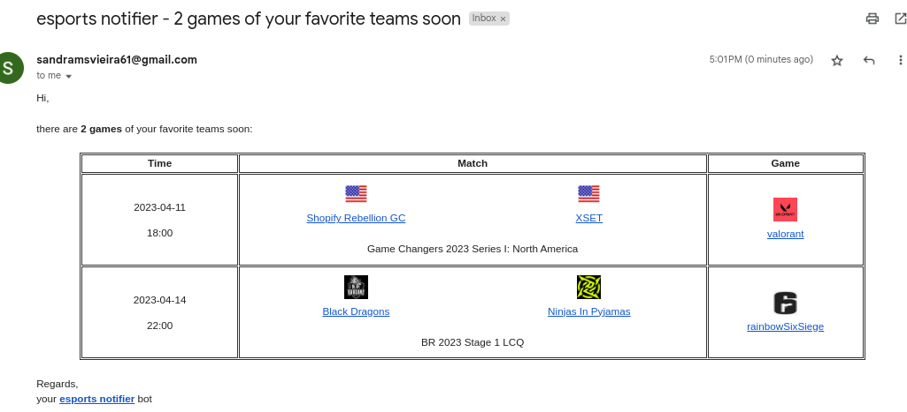
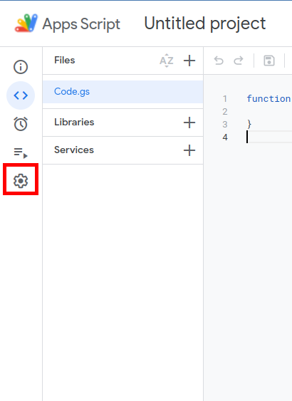

<h3 align="center">
  ESPORT NOTIFIER
</h3>

  
  
  

  <a href="#dart-features">Features</a> • <a href="#warning-requirements">Requirements</a> • <a href="#bulb-usage">Usage</a> • <a href="#books-about">About</a>

  
see <b>table of content</b>

  

    <ul>
      <!-- <li><a href="#trumpet-overview">Overview</a></li> -->
      <!-- <li><a href="#pushpin-table-of-contents">TOC</a></li> -->
      <li><a href="#dart-features">Features</a></li>
      <li><a href="#warning-requirements">Requirements</a></li>
      <li>
        <a href="#bulb-usage">Usage</a>
        <ul>
          <li><a href="#how-it-works">How it works?</a></li>
          <li><a href="#installation">Installation</a></li>
          <li><a href="#uninstall">Uninstall</a></li>
        </ul>
      </li>
      <li>
        <a href="#books-about">About</a>
        <ul>
          <li><a href="#license">License</a></li>
          <li><a href="#contributing">Contributing</a></li>
          <li><a href="#feedback">Feedback</a></li>
        </ul>
      </li>
    </ul>
  

## :trumpet: Overview

Get a daily email informing what are the today matches of your favorite teams in a bunche of esports games, including [csgo](https://www.counter-strike.net/), [valorant](https://playvalorant.com/) and [league of legends](https://www.leagueoflegends.com/).

  <table align="center">
    <thead>
      <tr>
        <td>
Desktop view
</td>
        <td>
Mobile view
</td>
      </tr>
    </thead>
    <tbody>
      <tr>
        <td></td>
        <td></td>
      </tr>
    </tbody>
 </table>

## :dart: Features

&nbsp;&nbsp;&nbsp;✔️ get daily email informing what are your favorite teams today matches; 
&nbsp;&nbsp;&nbsp;✔️ select the games you are interested in to check for matches; 
&nbsp;&nbsp;&nbsp;✔️ specify the time to send the daily email; 
&nbsp;&nbsp;&nbsp;✔️ option to informe matches about only the current date or also from the following days. 

Also it is worth mentioning that the tool informs about the following games:

- [x] [counter-strike global offense](https://liquipedia.net/counterstrike/Liquipedia:Matches)
- [x] [valorant](https://www.vlr.gg/matches)
- [x] [rainbow six siege](https://siege.gg/matches)
<!-- - [ ] overwatch 2
- [ ] dota 2
- [ ] league of legends
- [ ] free fire
- [ ] rocket league
- [ ] call of duty -->

## :warning: Requirements

The only thing you need to use this solution is a `gmail/google account`.

## :bulb: Usage

### How it works

It basically sets a function to run in google apps scripts to run everyday at a specified time, and this function is responsable for:

- get all the the matches scheduled for the next couple of days in all games that you're interested in;
- filter the matches list to get only the ones about your favorite teams;
- if there's at least one game of your favorite teams, send you an email about informing the details.

### Installation

To effectively use this project, do the following steps:

  
1 - create a Google Apps Scripts (GAS) project

  

     
    
Go to the <a href="">google apps script</a> and create a new project by clicking in the button showed in the next image. 
    It would be a good idea to rename the project to something like "esports-notifier".

    

  

  
2 - setup the esports-notifier on GAS

  

     
    
Click on the initial file, which is the <b>rectangle-1</b> on the image.

    

    
Replace the initial content present in the <b>rectangle-2</b> with the content present in <a href="./src/notifier.js">notifier.js</a>.

    <blockquote>
      
⚠️ Warning 
       Remember to update the <code>CONFIGS</code> object according to your data and needs.

    </blockquote>
  

  
3 - allow the required google permissions

  

     
    
Go to the project settings by clicking on the <b>first image rectangle</b>. After that, check the option to show the <code>appsscript.json</code> in our project, a file that manages the required google api access.

    

      <table>
        <tr>
          <td width="400">
            
          </td>
          <td width="400">
            
          </td>
        </tr>
      </table>
    

    
Go back to the project files, and replace the content present in the <code>appsscript.json</code> with the following code:
    

    <pre>
<!-- <DYNFIELD:GAS_APPSSCRIPT> -->
{
  "timeZone": "Etc/GMT",
  "dependencies": {
    "libraries": [
      {
        "userSymbol": "Cheerio",
        "version": "14",
        "libraryId": "1ReeQ6WO8kKNxoaA_O0XEQ589cIrRvEBA9qcWpNqdOP17i47u6N9M5Xh0"
      }
    ]
  },
  "oauthScopes": [
    "https://www.googleapis.com/auth/script.scriptapp",
    "https://www.googleapis.com/auth/script.external_request",
    "https://www.googleapis.com/auth/script.send_mail",
    "https://www.googleapis.com/auth/userinfo.email"
  ],
  "exceptionLogging": "STACKDRIVER",
  "runtimeVersion": "V8"
}
<!-- </DYNFIELD:GAS_APPSSCRIPT> -->
</pre>
  

  
4 - setup the twitch-notifier to run automatically every x minutes

  

     
    
Just follow what the bellow image shows, which is to select the <code>setup</code> function and run it. 
    After, a popup will appear asking your permission, and you'll have to accept it.

    

  

### Uninstall

If you want to receive the daily emails, just go to the GAS respective project and run the function called "uninstall".

By doing that, the GAS trigger responsable for running everyday the function will be deleted.

## :books: About

## License

This project is distributed under the terms of the MIT License Version 2.0. A complete version of the license is available in the [LICENSE](LICENSE) file in this repository. Any contribution made to this project will be licensed under the MIT License Version 2.0.

## Feedback

Any questions or suggestions? You are welcome to discuss it on:

- [Github issues](https://github.com/lucasvtiradentes/twitch-notifier/issues)
- [Email](mailto:lucasvtiradentes@gmail.com)

  

    
    
    
    
  

  
Made with ❤️ by <b>Lucas Vieira</b>

  
👉 See also all <a href="https://github.com/lucasvtiradentes/lucasvtiradentes/blob/master/portfolio/PROJECTS.md#TOC">my projects</a>

  
👉 See also all <a href="https://github.com/lucasvtiradentes/my-tutorials/blob/master/README.md#TOC">my articles</a>

